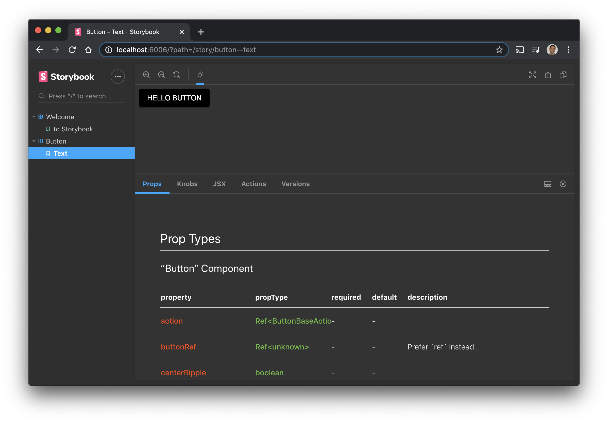

# storybook-boilerplate

My ideal storybook setup. [View a demo](https://petermikitsh.github.io/storybook-boilerplate/latest).

## Features

### Versioning

Each release is deployed in a separate folder on the `gh-pages` branch. Easily track how components change over time.

Check it out: https://github.com/petermikitsh/storybook-boilerplate/tree/gh-pages

### JSX Code Samples

With parity between dev and production builds.

### Dark Mode

Just because.
